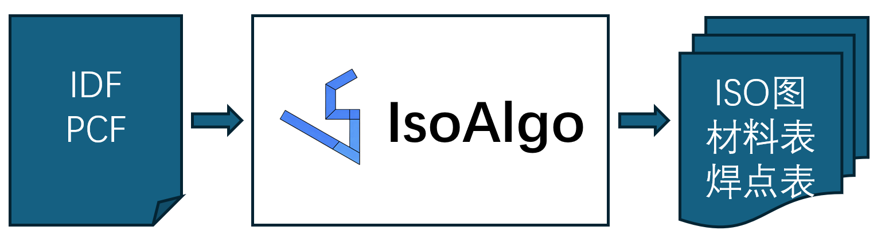
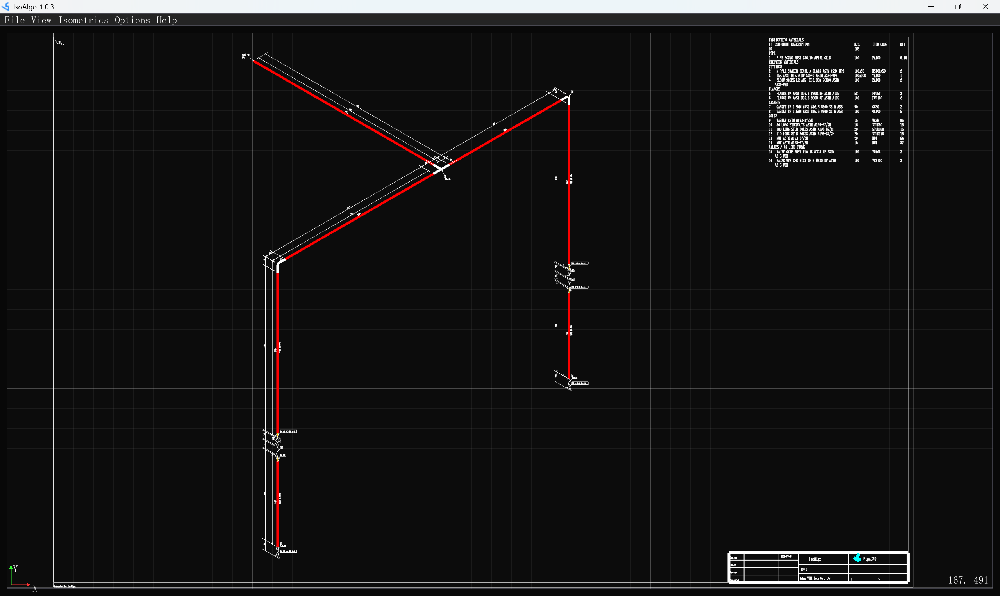
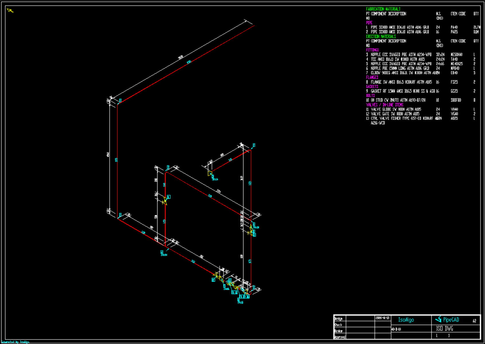

# IsoAlgo

IsoAlgo-Piping `Iso`metric drawing generation `Algo`rithm. IsoAlgo can processes PCF/IDF files to produce isometric drawings and reports. IsoAlgo has the following features:

+ Read piping PCF and IDF file format;
+ It has same symbol with ISOGEN;
+ It has many options to config drawing sytles;

IsoAlgo workflow is read PCF/IDF file which exported by Plant Design System and generate isometric drawing and reports automatically:

## IsoAlgoCmd

Run `IsoAlgoCmd` to call `IsoAlgo` to generate isometric drawing. The GUI of `IsoAlgoCmd` is simple:

The usage of `IsoAlgoCmd` has 3 steps:

+ Set option file;
+ Set piping file: PCF/IDF file;
+ Generate isometric drawing; 

Here is sample isometric drawing generated by IsoAlgo:

## Download IsoAlgo

`IsoAlgo` has `Personal Edition` and `Professional Edition`, `Personal Edition` is free to use.

| IsoAlgo Function | Professional Edition | Personal Edition |
|------------------|------------------|----------------------|
| Read PCF file    | :heavy_check_mark: | :heavy_check_mark: |
| Read IDF file    | :heavy_check_mark: | :heavy_check_mark: |
| Auto splitting   | :heavy_check_mark: | :heavy_check_mark: |
| Dimension | :heavy_check_mark: | :heavy_check_mark: |
| Annotation | :heavy_check_mark: | :heavy_check_mark: |
| Material reports | :heavy_check_mark: | :heavy_check_mark: |
| Weld reports | :heavy_check_mark: | :heavy_check_mark: |
| Cut piece reports | :heavy_check_mark: | :heavy_check_mark: |
| Spool reports | :heavy_check_mark: | :heavy_check_mark: |
| Drawing frame | :heavy_check_mark: | :x: System |

## Tech Support

If you have any questions or suggestions about `IsoAlgo`, please contact us: 

whtuhe@qq.com
